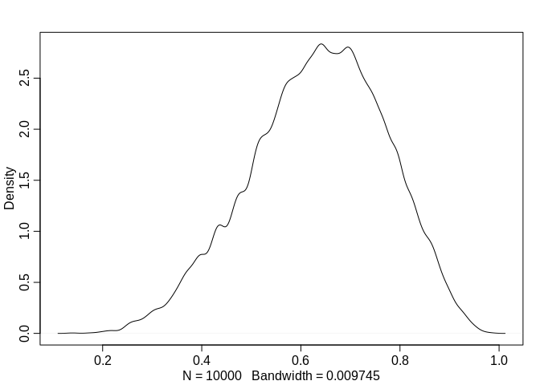
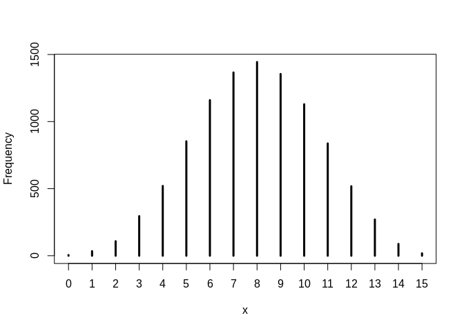
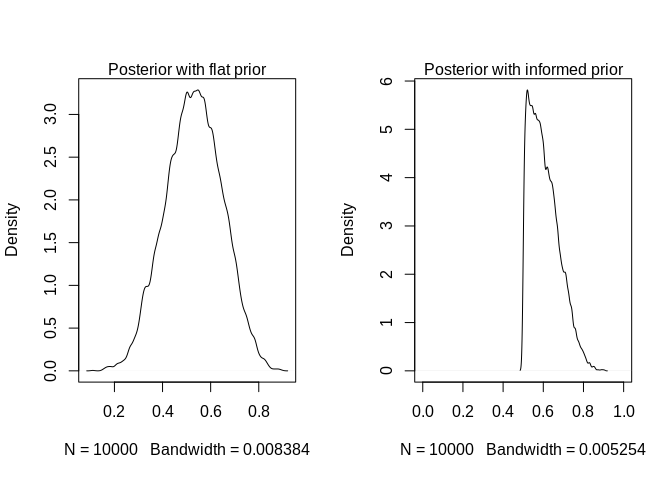
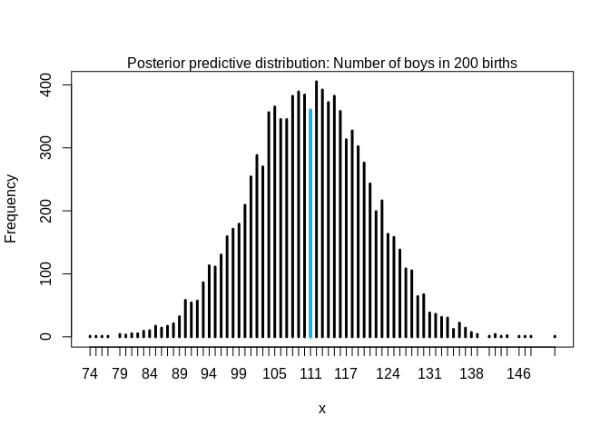
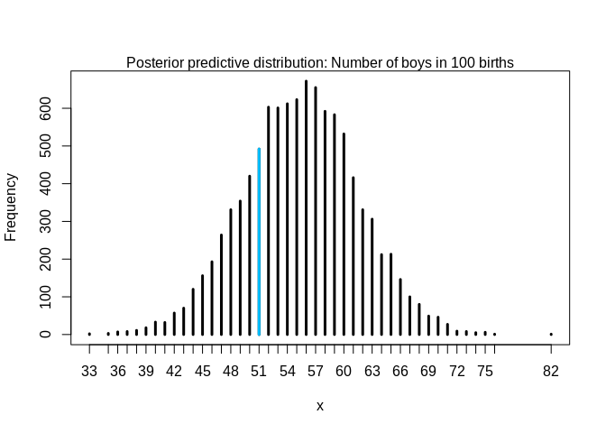
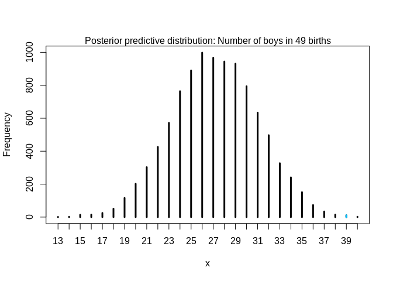

Chapter 3 - Exercise Solutions
================
Corrie Bartelheimer

These are my solutions to the practice questions of chapter 3, *Sampling
the Imaginary*, of the book “Statistical Rethinking” (version 2) by
Richard McElreath.

## Easy.

The Easy problems use the samples from the globe tossing example:

``` r
p_grid <- seq( from=0, to=1, length.out=1000 )
prior <- rep( 1, 1000 )
likelihood <- dbinom( 6, size=9, prob=p_grid)

posterior <- likelihood * prior
posterior <- posterior / sum(posterior)

set.seed(100)
samples <- sample( p_grid, prob=posterior, size=1e4, replace=TRUE )
```

**3E1.** How much posterior probability lies below \(p=0.2\)?

``` r
mean( samples < 0.2 )
```

    ## [1] 4e-04

**3E2.** How much posterior probability lies above \(p=0.8\)?

``` r
mean( samples > 0.8 )
```

    ## [1] 0.1116

**3E3.** How much posterior probability lies between \(p=0.2\) and
\(p=0.8\)?

``` r
mean( samples > 0.2 & samples < 0.8 )
```

    ## [1] 0.888

**3E4.** 20% of the posterior probability lies below which value of
\(p\)?

``` r
quantile( samples, probs = 0.2 )
```

    ##       20% 
    ## 0.5185185

20% of the posterior probability is below 0.52.

**3E5.** 20% of the posterior probability lies above which value of
\(p\)?

``` r
quantile( samples, probs = 0.8 )
```

    ##       80% 
    ## 0.7557558

20% of the posterior probability is above 0.76.

**3E6.** Which values of \(p\) contain the narrowest interval equal to
66% of the posterior probability?

``` r
library(rethinking)
HPDI( samples, prob = 0.66 )
```

    ##     |0.66     0.66| 
    ## 0.5085085 0.7737738

66% of the posterior probability is between 0.51 and 0.77.

**3E7.** Which values of \(p\) contain 66% of the posterior probability,
assuming equal posterior probability both below and above the interval?

``` r
PI( samples, prob = 0.66 )
```

    ##       17%       83% 
    ## 0.5025025 0.7697698

66% of the posterior probability is between 0.50 and 0.77. The
percentile interval is basically identical to the HPDI interval above,
implying that the posterior is highly symmetric:
<!-- -->

## Medium.

**3M1.** Suppose the glove tossing data had turned out to be 8 water in
15 tosses. Construct the posterior distribution, using grid
approximation and the same flat prior as above.

Since the prior and the grid stay the same, we only need to change the
likelihood:

``` r
likelihood <- dbinom( 8, size=15, prob=p_grid)
posterior <- likelihood * prior
posterior <- posterior / sum(posterior)
```

**3M2.** Draw 10,000 sample from the grid approximation from above and
use the samples to calculate the 90% HPDI for \(p\).

We can use the same code from above:

``` r
samples <- sample( p_grid, prob=posterior, size=1e4, replace=TRUE)
HPDI(samples, prob = 0.9 )
```

    ##      |0.9      0.9| 
    ## 0.3293293 0.7167167

**3M3.** Construct a posterior predictive check for this model and data.

  - Simulate the distribution of samples, averaging over the posterior
    uncertatinty in \(p\).

To compute the posterior predictive distribution, we generate samples
using the `rbinom()` function and the posterior samples:

``` r
w <- rbinom( 1e4, size = 15, prob=samples )
head(w)
```

    ## [1]  3 13  6  8  7 10

`w` is then a vector containing simulated predictions of 15 globe
tosses, averaged over the posterior probability
<!-- -->

  - What is the probability of observing 8 water in 15 tosses?

<!-- end list -->

``` r
mean( w == 8 )
```

    ## [1] 0.1444

The probability of observing 8 water in 15 tosses is around 14.4%.

**3M4.** Using the posterior distribution constructed from the new
(8/15) data, now calculate the probability of observing 6 water in 9
tosses.

We compute a new posterior predictive distribution, where we use 9
instead of 15 for the `size`:

``` r
w <- rbinom( 1e4, size = 9, prob=samples )
mean( w == 6 )
```

    ## [1] 0.1751

The probability to observe 6 water in 9 tosses (given the new data) is
around 18%.

**3M5.** Start over at **3M1**, but now use a prior that is zero below
\(p=0.5\) and a constant above \(p=0.5\). This corresponds to prior
information that a majority of the Earth’s surface is water. Repeat each
problem above and compare the inferences. What difference does the prior
make? If it helps, compare inferences (using both priors) to the true
value \(p=0.7\).

``` r
# I use 2, so the prior integrates to 1, 
# doesn't make much of a difference since we standardize later anyway
informed_prior <- ifelse( p_grid < 0.5, 0, 2 ) 
likelihood <- dbinom( 8, size = 15, prob=p_grid )
new_posterior <- likelihood * informed_prior
new_posterior <- new_posterior / sum(posterior )

new_samples <- sample( p_grid, prob=new_posterior, size=1e4, replace=TRUE)
```

<!-- -->

With the new, informed prior, the probability mass below 0.5 is zero.
The posterior with the flat prior still puts quite a bit of probability
mass below 0.5:

``` r
mean( samples < 0.5 )
```

    ## [1] 0.3957

We can compare how much probability mass the two different models put on
the interval between 0.6 and 0.8 (this includes the true value 0.7):

``` r
mean( samples > 0.6 & samples < 0.8 )
```

    ## [1] 0.2787

``` r
mean( new_samples > 0.6 & new_samples < 0.8)
```

    ## [1] 0.4586

The model with the informed prior puts much more probability mass on
this interval containing the true value.

**3M6.** Suppose yu want to estimate the Earth’s proportion of water
very precisely. Specifically, you want the 99% percentile interval of
the posterior distribution of \(p\) to be only 0.05 wide. This means,
the distance between the upper and lower bound of the interval should be
0.05. How many times will you have to toss the globe to do this?

We can just try some values. I am using here the true value of \(p\) for
the proportion of water to generate some “observed” data.

``` r
compute_pi_width <- function(N, true_p) {
  likelihood <- dbinom( round(N*true_p), size=N, prob=p_grid )
  posterior <- likelihood * prior
  posterior <- posterior / sum(posterior)
  samples <- sample(p_grid, prob=posterior, size=1e4, replace=TRUE )
  interval <- PI(samples, prob=0.99)
  names(interval) <- NULL
  diff( interval )
}

true_p <- 0.7
N <- 10
compute_pi_width(N, true_p)
```

    ## [1] 0.6176226

With 10 observations, we’re not even close yet.

``` r
N <- 100
compute_pi_width(N, true_p)
```

    ## [1] 0.2262262

Still some way to go.

``` r
N <- 1000
compute_pi_width(N, true_p)
```

    ## [1] 0.07407908

With 1000 observations, we’re getting quite close to an PI of 0.05
width. With \(N = 2200\) we then get a 95%-interval that is 0.05 wide.

``` r
N <- 2200
compute_pi_width(N, true_p)
```

    ## [1] 0.05105105

Note however that is depends on the true value of \(p\). If for example
the true value of \(p\) would be heavily biased, such as 0.995 (almost
all of Earth is water), then we’d only need 150 tosses to get such a
small interval.

``` r
N <- 150
compute_pi_width(N, true_p = 0.995)
```

    ## [1] 0.04704705

Similarly, using a more informed prior would also influence how many
observations are needed.

## Hard.

The Hard problems use the data below about the gender of the first and
second born children in 100 two-child families.

``` r
data(homeworkch3)
head(birth1)
```

    ## [1] 1 0 0 0 1 1

``` r
head(birth2)
```

    ## [1] 0 1 0 1 0 1

The total number of boys born across all of these births is then:

``` r
sum(birth1) + sum(birth2)
```

    ## [1] 111

**3H1.** Using grid approximation, compute the posterior distribution
for the probability of a birth being a boy. Assume a uniform prior
probability.

``` r
boys <- sum(birth1) + sum(birth2)
N <- length(birth1) + length(birth2)

p_grid <- seq( from=0, to=1, length.out = 10000 )
prior <- rep( 1, 10000 )
likelihood <- dbinom( boys, size=N, prob = p_grid)
posterior <- likelihood * prior
posterior <- posterior / sum(posterior )
```

Which parameter value maximizes the posterior probability?

``` r
p_grid[ which.max(posterior)]
```

    ## [1] 0.5549555

MAP, the maximum a posterior, value is around 0.55.

**3H2.** Using the `sample()` function, draw 10,000 random parameter
values from the posterior distribution and estimate the 50%, 89%, and
97% HPDIs.

``` r
samples <- sample(p_grid, prob=posterior, size=1e5, replace = TRUE)
HPDI(samples, c(0.5, 0.89, 0.97))
```

    ##     |0.97     |0.89      |0.5      0.5|     0.89|     0.97| 
    ## 0.4795480 0.4993499 0.5299530 0.5770577 0.6107611 0.6299630

**3H3.** Use `rbinom()` to simulate 10,000 replicates of 200 births.
Compare the distribution of predicted numbers of boys to the actual
count in the data.

``` r
pred_births <- rbinom(1e4, size=200, prob = samples)
```

<!-- -->

Our observed number of boys (in blue) is very much in the center of
predicted numbers of boys. Based on this check, we would say that our
model represents the observed data quite well.

**3H4.** Now compare 10,000 counts of boys from 100 simulated first
borns only to the number of boys in the first births, `births1`. How
does the model look in this light?

``` r
pred_births <- rbinom(1e4, size=100, prob = samples)
```

<!-- -->

Our observed number of boys in the first borns is slightly less central
in the posterior predictive distribution. However, it still seems to be
a fairly likely outcome.

**3H5.** The model assumes that sex of first and second births are
independent. To check this assumption, focus now on second births that
followed female first borns. Compare 10,000 simulated counts of boys to
only those second births that followed girls. Compare the counts of boys
in your simulations to the actual observed count of boys following
girls. How does the model look in this light? Any guesses what is going
on in these data?

``` r
followed_a_girl <- birth2[birth1 == 0]
pred_births <- rbinom(1e4, size=length(followed_a_girl), prob = samples)
```

<!-- -->

Our observed number of boys that followed a first-born girl (here in
blue) is with 39 out of 49 births much higher than what is predicted by
our model. According to our model, only a bit more than half of these
births would be a boy but the observed data suggests that if the
first-born is a girl, the chance of the second child being a boy is much
much higher. It seems there is some biological mechanism in which the
sex of the first child influences the sex of the second child. Since our
model assumes complete independece between all births, the model fails
to capthure this.

<small>[Full
code.](https://github.com/corriebar/statrethinking_reading_group/blob/master/chapter_3/chapter3_ex.Rmd)<small>
